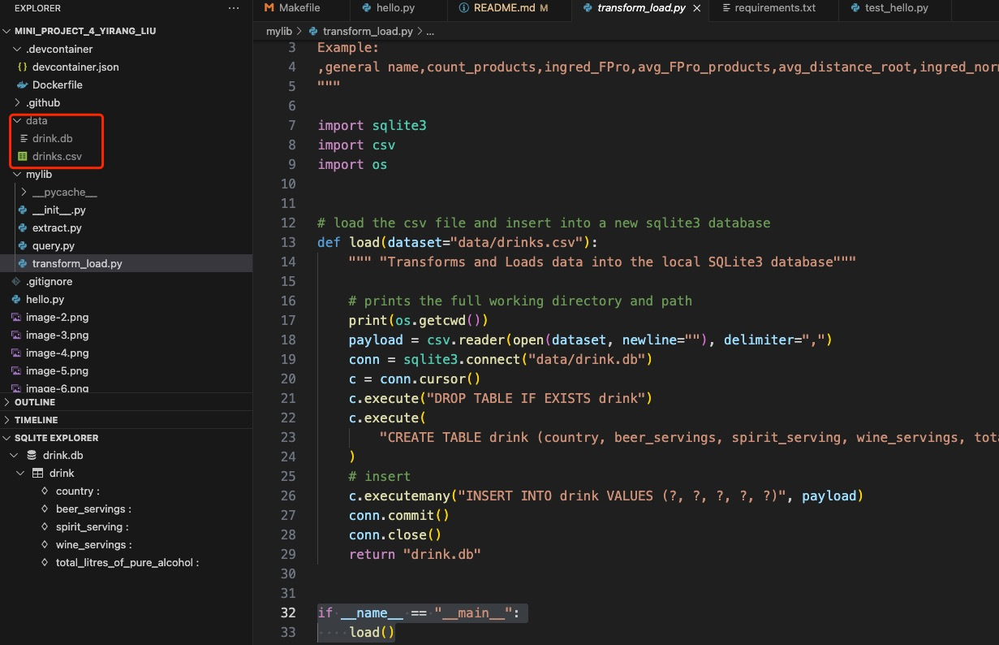
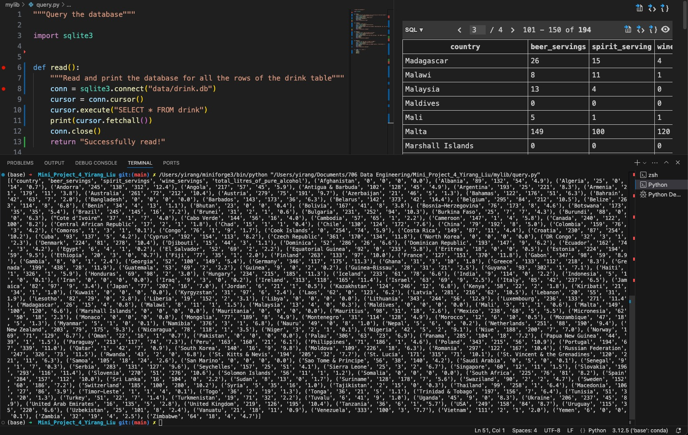
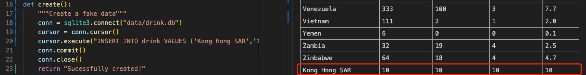
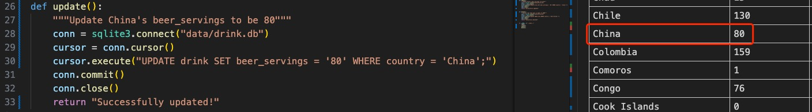
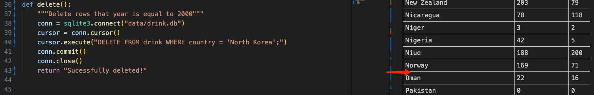

[](https://github.com/nogibjj/Mini_Project_4_Yirang_Liu/actions/workflows/main.yml)


# 706-DE-Mini_Project_4

## Requirements
- Connect to a SQL database
- Perform CRUD operations
- Write at least two different SQL queries

## Grading Criteria

- Database connection (20 points)
- CRUD operations (20 points)
    - create, read, update, and delete to an external site.
- CI/CD pipeline (10 points)
    - Test each operation works by loading the .db - file into your pipeline 
- README.md (10 points)

## Deliverables

- Python script
- Screenshot or log of successful database operations

## Submission 
- Public repository URL


## Project Structure

The project is organized as follows:

  ```bash
  tree -L 2
  ```

## Purpose of the project
This project aims to create a basic ETL pipeline by connecting to SQLite and performing simple SQL queries on a fivethirtyeight data on alcohol consumptions across countries !
([E] Extract a dataset from URL, [T] Transform, [L] Load into SQLite Database and [Q] Query For the ETL-Query lab)
[alt text](image.png)

[E] Extract: extract a csv file from url and create file (data.csv) in local directory


[T] Transform and [L] Load: Transform the csv file into a db file and connect to SQLite


[Q] Query: Perform CRUD (Create, Read, Update and Delete) operations
Read - reading and printing each of the rows in the dataset

Create - Create a new row and add it to the table

Update - Update rows based on a condition

Delete - Delete rows based on a condition
